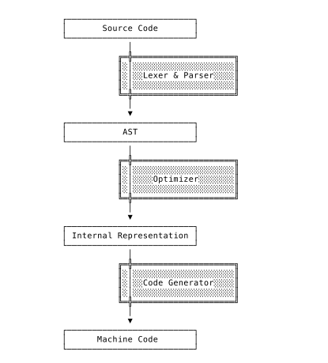
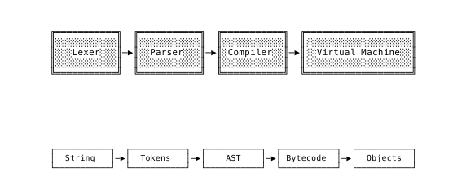
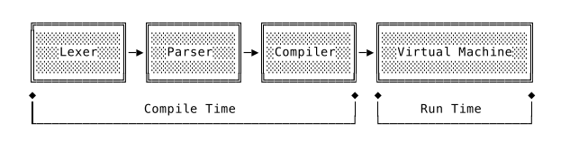
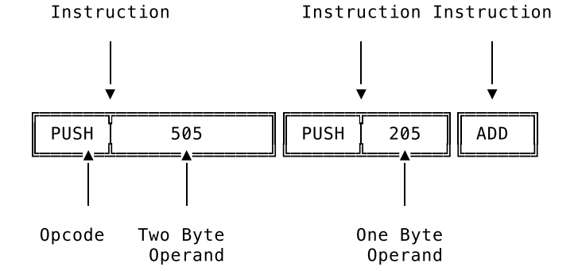

# **Compiler written in Go for the Monkey language**

**Compiler written in Go.**

## About this project:
**Monkey language has the following language features:**
  * Integers
  * Booleans 
  * Strings
  * Arrays 
  * Hashes 
  * Prefix-, infix- and index operators
  * Conditionals 
  * Global and local bindings 
  * First-class functions 
  * Return statements 
  * Closures

## Let’s see what Monkey looks like:

Here is how we bind values to names in Monkey:

```c:
let age = 1;
let name = "Monkey"; 
let result = 10 * (20 / 2);
```
Besides integers, booleans and strings, the Monkey interpreter we’re 
going to build will also support arrays and hashes. Here’s what binding 
an array of integers to a name looks like: 

```c:
let myArray = [1, 2, 3, 4, 5];
```
And here is a hash, where values are associated with keys: 

```c:
let thorsten = {"name": "Thorsten", "age": 28};
```

Accessing the elements in arrays and hashes is done with index expressions:

```c: 
myArray[0] _// => 1_
thorsten["name"] _// => "Thorsten"_
```

The let statements can also be used to bind functions to names. Here’s a 
small function that adds two numbers: 

```c: 
let add = fn(a, b) { return a + b; };
```

But Monkey not only supports return statements. Implicit return values are 
also possible, which means we can leave out the return if we want to:

```c: 
let add = fn(a, b) { a + b; };
```

And calling a function is as easy as you’d expect: 

```c: 
add(1, 2);
```

A more complex function, such as a fibonacci function that returns the 
Nth Fibonacci number, might look like this: 

```c: 
let fibonacci = fn(x) { 
    if (x == 0) { 
        0
    } else { 
        if (x == 1) { 
            1
        } else { 
            fibonacci(x - 1) + fibonacci(x - 2);
        } 
    } 
}; 
```

>Note the recursive calls to fibonacci itself!

Monkey also supports a special type of functions, called higher order 
functions. These are functions that take other functions as arguments. 
Here is an example:

```c:
let twice = fn(f, x) { 
    return f(f(x));
};

let addTwo = fn(x) { 
    return x + 2;
}; 

twice(addTwo, 2); // => 6
```

## Why Go?

* Go is really easy to read and subsequently understand.
* With Go’s universal formatting style thanks to gofmt and a testing
  framework built-in, we can concentrate on our interpreter and not
  worry about 3rd party libraries, tools and dependencies.

## How the compiler works

> A compiler is computer software that transforms computer code written in 
> one programming language (the source language) into another computer 
> language (the target language). Compilers are a type of translator that 
> support digital devices, primarily computers. The name compiler is 
> primarily used for programs that translate source code from a high-level 
> programming language to a lower level language (e.g., assembly language, 
> object code, or machine code) to create an executable program.
> -- <cite>Wikipedia</cite>

**Compiling cycle**
> The variety between compilers is so high that we can’t make a lot of universal 
> statements about their architecture. That being said, we can ignore the
> details for a minute now and sketch out the architecture of something 
> like the archetype of a compiler[Thorsten Ball]:


**Generation Order**
Now our project is going to take a different path from the Interpreter,
now se don't have our REPL to see the results in a fast cycle. This is 
the actual Generation order for our compiler.


**Compilation Time vs RunTime**

We need to make the difference between Compile Time and Runtime values, as far 
as this is going to impact our compiler.


**Stack Machine (Virtual Machine).**
- Why a Virtual Machine?
  
  > When we implement a programming language we want it to be universal. 
  > It should be able to execute all possible programs and not just – as 
  > one example of many – functions we built into it. Universal computation
  > is what we’re after and computers offer a solid model for it.
  > 
  > If we construct a programming language based on that model, it’s 
  > going to have the same computational capabilities as the computer.
  > It’s also one of the fastest ways to execute programs.
  > 
  > But if executing programs like a computer is the best and fastest way,
  > why not, you know, just let the computer execute the programs? 
  > **Portability**. We could write a compiler for our programming language 
  > that allows us to execute the translated programs natively on a computer.
  > These programs would be really fast. But we would also have to write 
  > a new compiler for every computer architecture we want to run our 
  > programs on. That’s a lot of work. Instead, we can translate our 
  > programs into instructions for a virtual machine. And the virtual
  > machine itself runs on as many architectures as its implementation 
  > language. In the case of the Go programming language that’s pretty 
  > portable. 
  > -- <cite>Thorsten Ball</cite> 

**Bytecode**
  > Virtual machines execute bytecode. Like the machine code that computers
  > execute, bytecode is made up of instructions that tell the machine what
  > to do. Push this, pop that, add these, call this function. It’s called
  > bytecode because the opcodes contained in each instruction are one byte
  > in size.
  > 
  > An “opcode” is the “operator” part of an instruction, sometimes also 
  > called “op”. The PUSH we’ve seen earlier is such an opcode, except that 
  > in our toy example it was a multi-byte string and not just one byte. In a 
  > proper implementation PUSH would just be the name that refers to an 
  > opcode, which itself is one byte wide. These names, like PUSH or POP,
  > are called mnemonics. They help us programmers remember and talk about 
  > opcodes.
  > 
  > The operands (also called arguments or parameters) to these opcodes are 
  > also contained in the bytecode. They’re placed alongside each other, with
  > the operands following the opcodes. The operands, though, aren’t necessarily
  > one byte wide. For example, if an operand is an integer and greater than 
  > 255, it would take multiple bytes to represent it. Some opcodes have
  > multiple operands, some just one and some don’t have any at all. Whether 
  > the bytecode is designed for a register, or a stack machine has a huge 
  > influence here.
  > 
  > You can imagine bytecode as a sequence of opcodes and operands, laid 
  > out in memory next to each other:
  > -- <cite>Thorsten Ball</cite>


## **Our Compiler is faster than our Interpreter!**
We build it into its own executable: 
> $ go build -o fibonacci ./benchmark

And now, welcome, first on the stage, the evaluator:
> $ ./fibonacci -engine=eval 
> 
> engine=eval, result=9227465, duration=27.204277379s 

27 seconds. Time for our final pat on the back:
> $ ./fibonacci -engine=vm 
> 
> engine=vm, result=9227465, duration=8.876222455s

8 seconds. **3.3 times faster.**

## References:

This work it's based on the book 
>Writing an Interpreter in Go by Thorsten Ball

> **LICENSED UNDER MIT LICENSE**